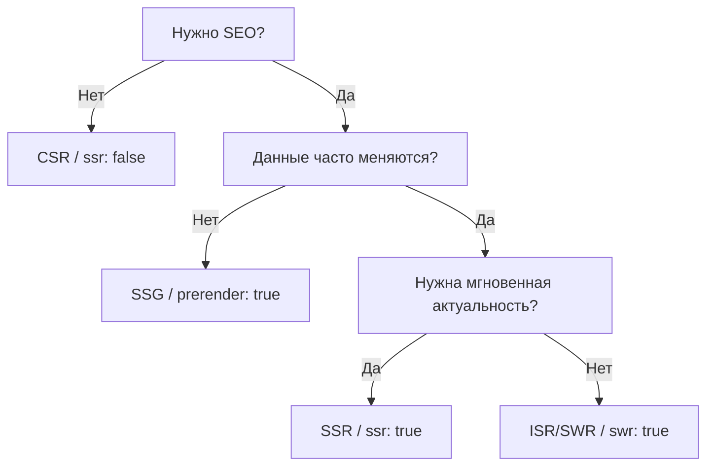

#ssr #csr #ssg #isr #swr #prerender #build


## 🚀 Шпаргалка по рендерингу в Nuxt 3/4: SSR, CSR, SSG и Hybrid

Данный гайд поможет быстро выбрать стратегию рендеринга и настроить её в `nuxt.config.ts`.

> 1. **SSR** (Server-Side Rendering) → `HTML + данные` - это рендеринг HTML на сервере при каждом HTTP-запросе. Используется, когда ==важны SEO== и ==актуальные данные== (каталог товаров, блог, маркетплейс).
> 	- *ISR*/*SWR* - кэширование, ==баланс между нагрузкой и актуальностью==, настраивается в через [[#3. Гибридный рендеринг Настройка `routeRules`|routeRules]] (новости, списки).
> 2. **SSG** (Static Site Generation) → `HTML заранее` - это генерация HTML [[#5. Статическая генерация страниц *prerender*|на этапе сборки]]. Подходит для статичных страниц, где ==данные редко меняются== (лендинги, контакты).
> 3. **CSR** (Client-Side Rendering) → `все в браузере` - это рендеринг на клиенте. Используется для SPA-интерфейсов, где ==SEO не критично==, а ==данные чувствительны== (личный кабинет, корзина).
> 4. **Shell** (App Shell Model) → HTML без данных - статическая генерация [[#7. App Shell Model|каркаса HTML]] (со статическими фрагментами). Нужна для ==быстрой отрисовки== и когда ==SEO не критично==.
> 5. **Hybrid** = SSR + CSR - используется в Nuxt: первый рендер может быть SSR или SSG, а дальше работает как SPA.

---
---


## 1. Основные концепции (Кто и когда создает HTML?)

|Характеристика|CSR (Client)|SSR (Server)|SSG (Static)|
|---|---|---|---|
|Где создается HTML|В браузере|На сервере|На сервере|
|Когда|В реальном времени (Runtime)^[Не требует перерисованного HTML с сервера, однако по-прежнему делает запросы за данными]|При каждом *HTTP*-запросе^[Если не используется кэширование *ISR*/*SWR*. HTTP-запрос - это запрос к серверу (перезагрузка/прямой переход). В SPA-приложении клик != HTTP-запросу!]|В момент сборки (`build`)|
|Скорость первой загрузки|Низкая|Высокая|Очень высокая|
|SEO (поисковики)|Плохое (из коробки)|Отличное|Отличное|
|Нагрузка на сервер|Минимальная|Высокая|Практически нулевая|
|**ГЛАВНАЯ ФИШКА**|==Экономит ресурсы сервера==|==Идеально для SEO и динамики==|==Самая быстрая загрузка==|

|Сценарий|SSR будет?|
|---|---|
|открыть страницу напрямую|✅|
|F5|✅|
|переход по ссылке извне|✅|
|переход внутри SPA|❌|

---
---

## 2. Матрица выбора стратегии в Nuxt

Nuxt использует Universal Rendering (SSR + CSR одновременно). С помощью `routeRules` мы можем точечно менять это поведение.



---
---

## 3. Гибридный рендеринг: Настройка `routeRules`

Это самый мощный инструмент Nuxt. Позволяет сочетать все типы в одном проекте.

```typescript
// nuxt.config.ts
export default defineNuxtConfig({
  ssr: true, // Базовый режим — Universal (SSR + CSR)

  routeRules: {
    // Сценарий А: Статика (SSG)
    // Идеально для: О нас, Контакты, FAQ
    '/about': { prerender: true },

    // Сценарий Б: Кэширование (SWR / ISR)
    // Идеально для: Каталог, Блог, Новости
	'/news/**': { swr: true }, // Отдавать из кэша, а в фоне обновлять кэш
    '/catalog/**': { swr: 600 } // Обновлять кэш в фоне не чаще, чем раз в 10 минут
    '/blog/**': { isr: 3600 }, // Обновлять кэш строго раз в час

    // Сценарий В: Чистый клиент (CSR)
    // Идеально для: Личный кабинет, Настройки, Админка - быстрый показ каркаса
    '/admin/**': { ssr: false },

    // Сценарий Г: Стандартный SSR
    // Идеально для: Поиск, Корзина
    '/search/**': { ssr: true },
  }
})
```

---
---

## 4. Продвинутое кэширование: SWR vs ISR

Оба метода отдают страницу мгновенно из кэша, пока сервер обновляет её в фоне.

- **SWR** (Stale-While-Revalidate): Отдает "протухший" контент, пока идет фоновая проверка. Если данные изменились, следующий пользователь увидит новое.
    
    - _Настройка:_ `{ swr: true }` (или число в секундах).
    
- **ISR** (Incremental Static Regeneration): Тот же механизм, но акцент на времени жизни кэша (TTL) - в течение периода возвращается кэш, а затем первый же запрос обновляет данные и отдает их.
    
    - _Настройка:_ `{ isr: 3600 }`.
    

Главное отличие: В Nuxt/Nitro они почти идентичны. Они позволяют не пересобирать весь проект (как в SSG), чтобы обновить одну опечатку или цену, если данные тянутся из API/БД.


---
---

## 5. Статическая генерация страниц: *prerender*

👉 Используй `ssr: true` + `prerender: true` (для конкретных маршрутов). 

> При *prerender* страница генерируется один раз на этапе сборки (`build`). Стандартные *fetch*-запросы отработаются также один раз. 
> 
> Если *fetch*-запрос на странице выполняется с `server: false`^[Позволяет отложить загрузку данных до клиента, что полезно для персонализированных данных, снижения нагрузки на сервер, случаев, когда SSR не имеет смысла (не важен SEO) или когда есть зависимость от клиента (localStorage, window, токены)] или внутри `onMounted`, то эти методы **принудительно отключают SSR**, и запрос не участвует в серверной генерации HTML (SSR/SSG), и запрос будет выполнен уже в браузере (CSR) — то есть клиент обратится к серверу за данными^[Поэтому такой запрос выполняется только в браузере и, следовательно, не участвует в статической генерации HTML].

Cхема:

```ts
// SSG + обычный useFetch:
"build → fetch → HTML с данными → браузер (без запросов)"
```
```ts
// SSG + server:false:
"build → HTML без данных → браузер → fetch → сервер"
```

Пример:

```ts
<script setup>
// Текст статьи зарендерится один раз при сборке (SEO)
const { data: article } = await useFetch('/api/article')

// А цена будет подтягиваться с сервера каждый раз при открытии страницы браузером
const { data: price } = await useFetch('/api/price', { server: false })

// => аналогично
onMounted(async () => price = await $fetch('/api/price'))
</script>
```


---
---


## 6. Иерархия решений (Чек-лист для памяти)

1. Хочу полную отрисовку и SEO для всего на сервере + данные должны всегда обновляться:
   
	- 👉 Используй `ssr: true`.
	  
2. Хочу добавить максимум скорости и безопасности + страница не меняется до следующего деплоя - жесткая фиксация готового html-файла (рендеринг страниц на этапе `build`):
    
    - 👉 Используй `prerender: true`.
    
3. Сервер не справляется с нагрузкой, а данные изменяются редко:
    
    - 👉 Используй `isr: 3600` (кэш на 1 час).
    
4. Аналогично, но данные меняются чуть чаще и кэш нужно обновлять в случае изменений:
    
    - 👉 Используй `swr: true` / `swr: 600` (кэш / кэш на 10 минут).

5. Нужно скрыть контент от поисковиков (личные данные):
    
    - 👉 Используй `ssr: false`.

---
---


## 7. App Shell Model

👉 Используй `{ ssr: false, prerender: true }`

> **App shell**^[Не использовать для SEO-страниц!] — это статическая оболочка приложения без данных, которая быстро отдается пользователю. Это не SSR и не SSG - это *стратегия загрузки UI*. 
>   
> Такой подход используется, когда SEO не критично, но важно быстро показать UI (например, лейаут) и снизить нагрузку на сервер.  
> 
> Данные в этом случае загружаются уже на клиенте после инициализации приложения.

|**Этапы**|`build`|Открытие страницы (CSR)|
|---|---|---|
|**Действия**|- сгенерировать на сервере каркас HTML<br/>- без данных (~~SSR~~)|- пользователь мгновенно видит интерфейс<br/>- дальше JS подгружает данные|

Схема:

```html
<header>Мой сайт</header>
<sidebar></sidebar>
<main>
  <!-- здесь пусто или loader -->
</main>
<footer></footer>
```

Примеры:

| |Статус|Цель|
|---|---|---|
|**🔹Кейс 1: сложный SPA (админка)**|- SEO не нужен<br/>- много интерактива<br/>- SSR только мешает|👉 хочется быстрый first paint|
|**🔹Кейс 2: тяжелый backend**|- API медленный<br/>- SSR тормозит страницу|❌ ждать сервер → HTML с данными<br/>✅ отдать shell → данные догружаются|
|**🔹Кейс 3: авторизация**|- данные зависят от пользователя<br/>- SSR бесполезен (нет токена)|👉 отдать пустой shell<br/>🔒 проверить auth<br/>⬇️ загрузить данные|
|**🔹Кейс 4: экономия ресурсов**|- SSR: каждый запрос = работа сервера|👉 меньше нагрузки:<br/>отдал HTML → всё дальше на клиенте|


---
---

## 7. Как это работает в браузере (UX)

1. **Первый вход**: Вы получаете готовый HTML (быстрая отрисовка).
2. **Гидратация**: Vue "оживляет" кнопки и формы.
3. **Навигация**: При клике по внутренним ссылкам Nuxt работает как SPA — он не запрашивает новую страницу целиком, а только данные (JSON), что делает сайт очень быстрым.

👉 SSR происходит при загрузке страницы с сервера (initial HTTP-request), но не при клиентской навигации внутри SPA.

👉 Отличие клиентской SPA-навигации:
- всегда только CSR;
- делает загрузку JS;
- делает fetch данных (если нужно).

👉 Если нужно принудительное обращение к серверу при SPA-переходе = новый HTTP-запрос → SSR:

```js
navigateTo('/page', { external: true })
// либо
window.location.href = '/page'
```


---
---

## 8. Почему Nuxt используют без SSR?

> Nuxt — это не только SSR, а fullstack-фреймворк

Он даёт:

- файловую маршрутизацию
- composables
- встроенный backend (`/server`)
- middleware
- layout-систему
- автоимпорты
- DX

👉 Поэтому:

> даже при `ssr: false` Nuxt остаётся удобнее, чем «голый Vue»


---

### Он даёт:

- файловую маршрутизацию
- composables
- встроенный backend (`/server`)
- middleware
- layout-систему
- автоимпорты
- DX

---

💡Совет: Если не знаешь, что выбрать — оставляй стандартный SSR (`ssr: true`). Если сайт начнет тормозить от нагрузки — добавляй ISR (`isr: true`) на самые посещаемые страницы.

